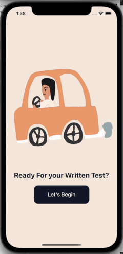

# React Native Animated Quiz App

This repository contains a dynamic quiz application created with React Native. It features animated buttons and a progress bar to provide a unique and interactive user experience.



## Features

- **Animated Buttons:** The app uses React Native's animation framework to produce smooth, visually engaging transitions and feedback upon user interaction.

- **Progress Bar:** The app includes a progress bar that updates in real-time based on the user's progress through the quiz.

- **React Navigation:** This app uses React Navigation for managing and organizing screen flow and navigation within the app.

## Getting Started

These instructions will help you set up a copy of this project locally. To get a local copy up and running, follow these steps:

### Prerequisites

- Node.js and npm: Node.js is the JavaScript runtime used by React Native, and npm is the Node.js package manager. You can download both from [Node.js official website](https://nodejs.org/).

- React Native CLI: This is needed to start your development server and run the app on a simulator or real device. Install it by running `npm install -g react-native-cli`.

- Android Studio or Xcode: Depending on whether you wish to run the app on Android or iOS, you'll need one of these. Android Studio can be downloaded from [the official website](https://developer.android.com/studio) and Xcode from the App Store.

### Installation

1. Clone the repo

```git clone https://github.com/Katrinasms/React-quiz-app-template.git```

2. Navigate into the cloned directory

```cd react-native-quiz-app```

3. Install NPM packages

```npm install```

4. If you are running the app on iOS, navigate to the iOS folder and install pods

```cd ios && pod install && cd ..```

5. Run the app on iOS

```npx react-native run-ios```

or Android

```npx react-native run-android```


## Usage

This project can be used as a template for any quiz app. You can customize it with your own questions, answers, animations, and much more. It serves as a great starting point for anyone looking to create an interactive quiz app with React Native.

## Contribution

Contributions make the open-source community such an inspiring place to learn, share and create. Any contributions you make are **greatly appreciated**.

1. Fork the Project
2. Create your Feature Branch (`git checkout -b feature/AmazingFeature`)
3. Commit your Changes (`git commit -m 'Add some AmazingFeature'`)
4. Push to the Branch (`git push origin feature/AmazingFeature`)
5. Open a Pull Request

## License

Distributed under the MIT License. See `LICENSE` for more information.